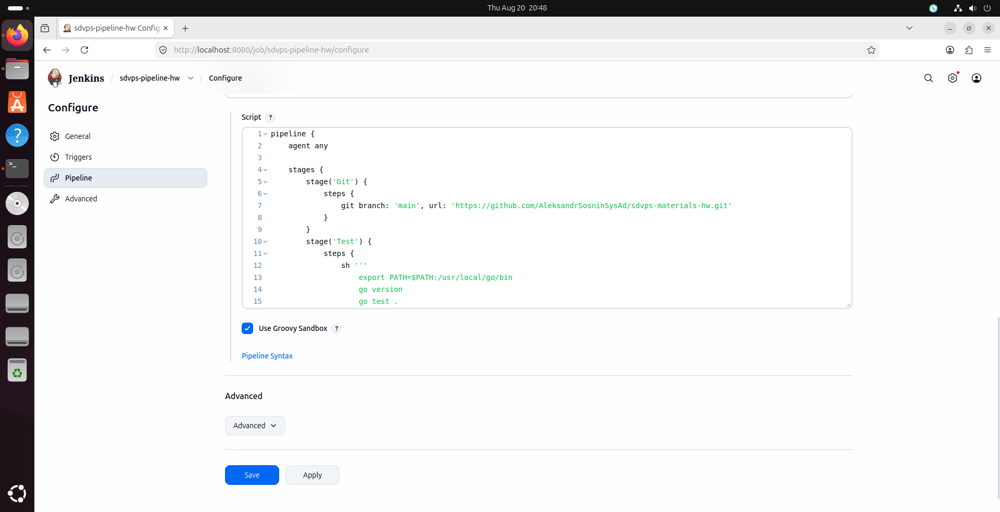
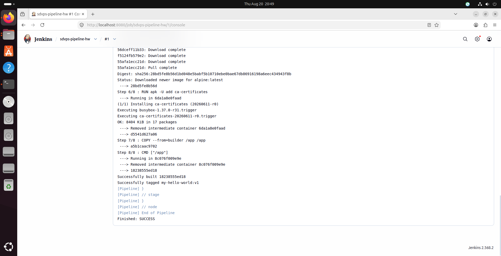
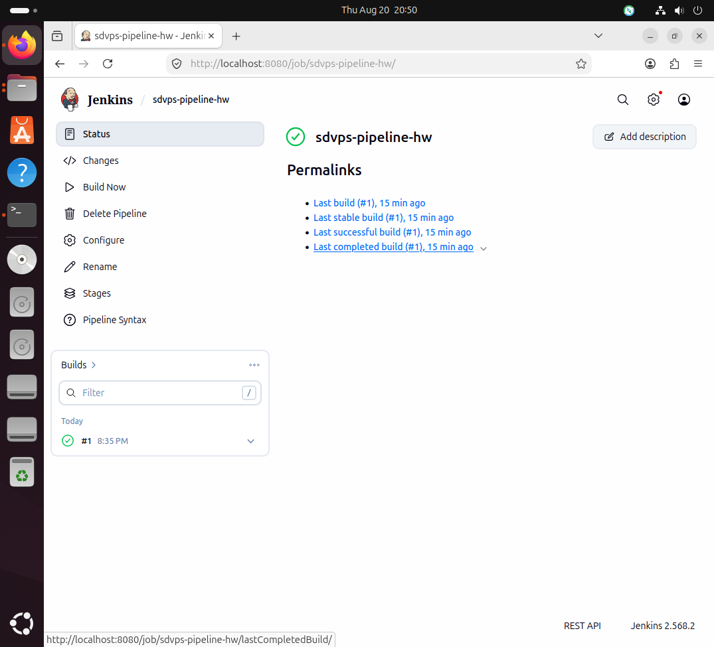

 
# Домашнее задание 8.2. Что такое DevOps. CI/CD

## Задание 1: Настройка Jenkins и создание Freestyle Project

### Что было сделано:

1. **Установлен Jenkins** на Ubuntu 24.04
2. **Установлен Go** версии 1.21.0
3. **Установлен Docker** и пользователь jenkins добавлен в группу docker
4. **Сделан форк** репозитория: https://github.com/AleksandrSosninSysAd/sdvps-materials-hw
5. **Создан Freestyle Project** в Jenkins с настройками:
   - Repository URL: https://github.com/AleksandrSosninSysAd/sdvps-materials-hw.git
   - Branch: */main
   - Build steps: Execute shell

### Скрипт сборки:

```bash
export PATH=$PATH:/usr/local/go/bin
go version
go test .
docker build . -t my-hello-world:v1
```


---

## Скриншоты

### Настройки проекта (Configure)


### Console Output


---

## Задание 2: Настройка Declarative Pipeline

### Что было сделано:
1. Создан новый проект типа **Pipeline** в Jenkins
2. Сборка из Задания 1 переписана на декларативный синтаксис (Declarative Pipeline)
3. Настроены этапы:
   - **Git** — клонирование репозитория
   - **Test** — запуск `go test .`
   - **Build** — сборка Docker-образа с тегом `v$BUILD_NUMBER`

### Скрипт Pipeline:
```groovy
pipeline {
    agent any
    
    stages {
        stage('Git') {
            steps {
                git branch: 'main', url: 'https://github.com/AleksandrSosninSysAd/sdvps-materials-hw.git'
            }
        }
        stage('Test') {
            steps {
                sh '''
                    export PATH=$PATH:/usr/local/go/bin
                    go version
                    go test .
                '''
            }
        }
        stage('Build') {
            steps {
                sh 'docker build . -t my-hello-world:v$BUILD_NUMBER'
            }
        }
    }
}
---

## Скриншоты

### Настройки проекта (Configure)


### Console Output


### Main


---
