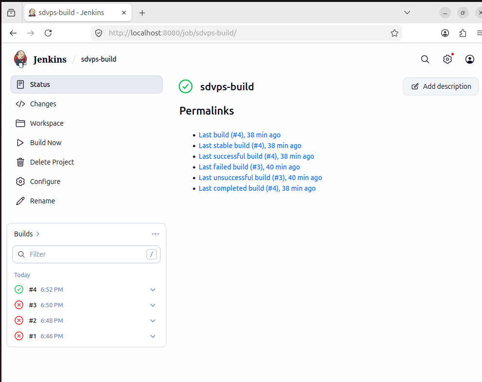
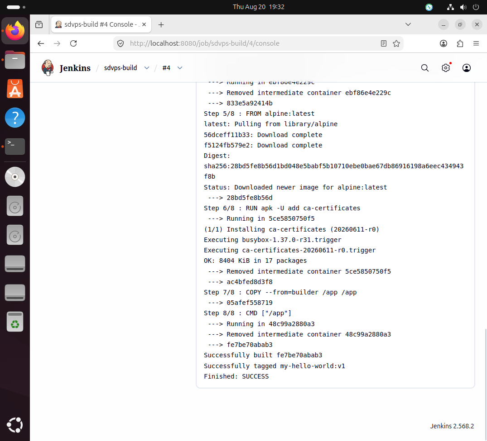

# Домашнее задание 8.2. Что такое DevOps. CI/CD

## Задание 1: Настройка Jenkins и создание Freestyle Project

### Что было сделано:

1. **Установлен Jenkins** на Ubuntu 24.04
2. **Установлен Go** версии 1.21.0
3. **Установлен Docker** и пользователь jenkins добавлен в группу docker
4. **Сделан форк** репозитория: https://github.com/AleksandrSosninSysAd/sdvps-materials-hw
5. **Создан Freestyle Project** в Jenkins с настройками:
   - Repository URL: https://github.com/AleksandrSosninSysAd/sdvps-materials-hw.git
   - Branch: */main
   - Build steps: Execute shell

### Скрипт сборки:

```bash
export PATH=$PATH:/usr/local/go/bin
go version
go test .
docker build . -t my-hello-world:v1


---

## Скриншоты

### Настройки проекта (Configure)


### Console Output

